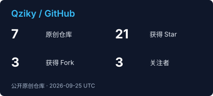
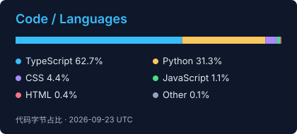

<div align="center">


<a href="https://www.qziky.com/"></a>
<a href="https://github.com/Qziky"></a>
<a href="mailto:1965463327@qq.com"></a>
<a href="https://t.me/Qziky"></a>

</div>

## `whoami`

```text
ID        Qziky
ROLE      Computer Science Student · Full-Stack Developer
FOCUS     Vibe Coding · AI Products · Creative Tools
LOCATION  Chengdu, Sichuan
MBTI      INFJ-T
```

> 把灵感变成产品，把复杂的技术变成简单的体验。

## Tech Stack

<div align="center">


</div>

| 能力 | 我在做什么 |
| --- | --- |
| 全栈开发 | 设计、开发、部署和维护完整项目 |
| AI 创作 | 探索 AI 辅助开发与内容生产 |
| 视觉表达 | PPT 制作、视频剪辑与产品呈现 |

## Connect

<div align="center">

[](https://space.bilibili.com/3690999129836344)
[](https://v.douyin.com/o7JAksrBQgE)
[](mailto:1965463327@qq.com)

</div>

## GitHub Pulse

<div align="center">

<a href="https://github.com/Qziky"></a>
<a href="https://github.com/Qziky"></a>

<br />


</div>

<div align="center">

<sub>Designed with curiosity · Built with code · Updated September 11, 2026</sub>

</div>
